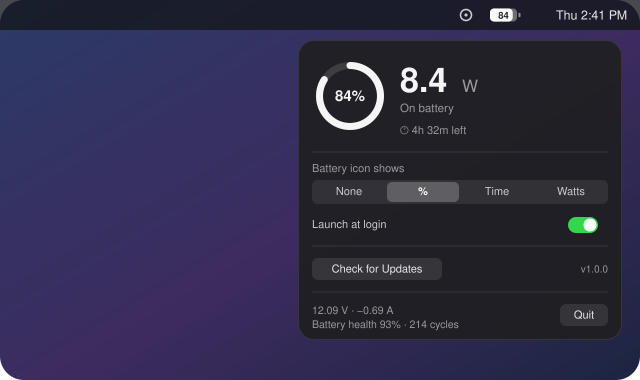

# BatteryWatts

**A tiny macOS menu bar app that shows — live, every second — how much power is flowing into (or out of) your MacBook's battery.**

<p align="center">
  <a href="https://github.com/michaelmax98/BatteryWatts/releases/latest/download/BatteryWatts.dmg">
    
  </a>
  <br>
  <sub>One click, direct download · macOS 13+ · free &amp; open source · <a href="https://github.com/michaelmax98/BatteryWatts/releases/latest">all releases</a></sub>
</p>



[](https://github.com/michaelmax98/BatteryWatts/releases/latest)
[](https://github.com/michaelmax98/BatteryWatts/actions/workflows/ci.yml)

A clean, flat, iOS-style battery icon sits in your menu bar. Click it for the live panel: charge/discharge wattage, battery percentage ring, time to full or time remaining, charger wattage, battery health, and cycle count.

## Install

1. Click the **Download** button above (it always grabs the newest DMG)
2. Open it and drag **BatteryWatts** into **Applications**
3. Launch it from Applications — the battery icon appears in your menu bar

> **First launch on a fresh download:** releases aren't notarized with a paid Apple Developer ID (yet), so macOS may block the first open. If double-clicking shows a warning, go to **System Settings → Privacy & Security**, scroll down to the "BatteryWatts was blocked" notice, and click **Open Anyway** (on older macOS versions, right-click the app → **Open** works too). This is only needed once.

Requires macOS 13 Ventura or later. No special permissions — battery data is read from public IOKit properties.

## Features

- **Live battery wattage** — positive and green while charging (energy flowing into the battery), and the real-time draw while on battery. Read from IOKit's instantaneous amperage × voltage at 1 Hz.
- **iOS-style battery icon** — modern and flat, with the reading punched into the battery shape. Choose what it shows inside: **nothing**, **percentage** (like `75`), **time remaining** (like `6h35m`; time to full while charging), or **live watts** with a direction arrow — `▴26W` charging into the battery, `▾8.4W` being drawn from it.
- **State color theme** — green while charging or plugged in, blue on battery, then orange and red as you cross your low-battery thresholds. The panel ring, the wattage number, and the menu bar icon all follow.
- **Low-battery alerts** — configurable warning and critical percentages, plus an optional pulsing neon glow around the screen edges (orange, then red) so a dying battery is impossible to miss.
- **Time estimates** — time to full / time remaining, same numbers as the system battery menu.
- **Details panel** — charger wattage, volts × amps, battery health, cycle count.
- **In-app updates** — the app checks this repo's Releases page and can download and open the new version for you.
- Native SwiftUI, light/dark aware, no Dock icon, optional Launch at Login.

## Updates

BatteryWatts checks GitHub for a new release every few hours (and there's a **Check for Updates** button in the panel). When one is available, click **Install Update** — the app downloads the new version, verifies it against the sha256 GitHub publishes for the release, swaps itself in place, and relaunches. One click, no dragging.

## Build from source

```bash
git clone https://github.com/michaelmax98/BatteryWatts.git
cd BatteryWatts
swift run -c release      # run it directly
./build-app.sh            # or build build/BatteryWatts.app
```

Releases are built by [GitHub Actions](.github/workflows/release.yml): pushing a `v*` tag compiles the app on a macOS runner, packages the DMG, and publishes it to the Releases page.

## How it reads power

Wattage comes from the `AppleSmartBattery` IORegistry entry (`InstantAmperage` × `Voltage`). Positive means the battery is being charged; negative means it's powering the Mac. Two things that are normal: into-battery watts are lower than your charger's rating (the charger also powers the Mac itself), and ~0 W while plugged in means the battery is full or Optimized Battery Charging is holding it.

## License

[MIT](LICENSE)
